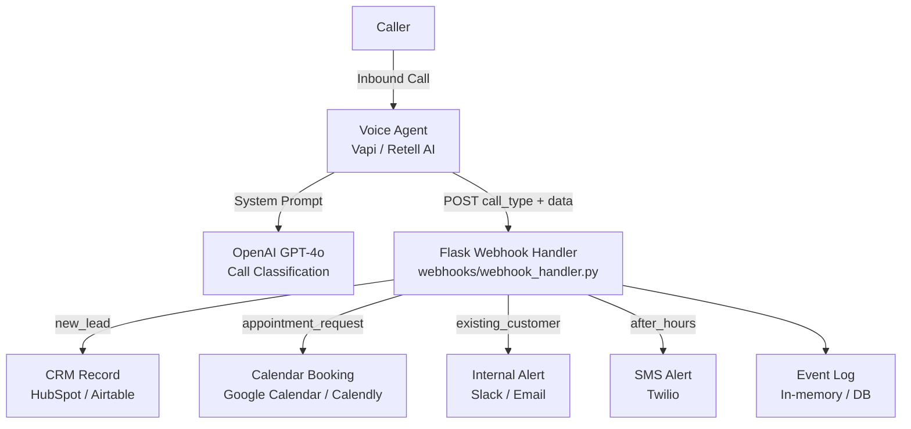

# AI Receptionist System

> Webhook-driven call intake and routing for AI voice agents.  
> Receives inbound call events, classifies intent, and routes to the right workflow —
> CRM intake, calendar booking, or escalation.

---

## Problem

Small businesses miss leads because inbound calls go unmanaged. No consistent intake,
no automatic routing, no follow-up logic. A human receptionist costs $35,000/year.
Voicemail converts at under 5%.

## Solution

An AI receptionist layer that handles inbound calls via a voice agent (Vapi / Retell),
classifies caller intent, and fires a webhook to the right downstream system — CRM,
calendar, or SMS alert — automatically.

---

## Architecture



---

## Tech Stack

| Layer | Technology |
|---|---|
| Voice AI | Vapi / Retell AI |
| Language Model | OpenAI GPT-4o |
| Webhook Handler | Python + Flask |
| Data Format | JSON |
| Testing | pytest |
| Integrations (planned) | Twilio, Google Calendar, HubSpot |

---

## Project Structure

```
ai-receptionist-system/
├── prompts/
│   └── receptionist_system_prompt.md   # Core AI agent prompt
├── webhooks/
│   ├── webhook_handler.py              # Flask app — routes call events
│   └── examples/
│       ├── appointment_payload.json    # Sample webhook payload
│       └── lead_intake_payload.json   # Sample webhook payload
├── workflows/
│   └── call-intake-flow.md            # Call routing logic docs
├── tests/
│   └── test_webhook_handler.py        # Flask test client tests
├── docs/
│   └── architecture.md
├── requirements.txt
└── README.md
```

---

## Quick Start

```bash
git clone https://github.com/standley2005-ship-it/ai-receptionist-system
cd ai-receptionist-system
pip install -r requirements.txt
python webhooks/webhook_handler.py
```

Test with curl:
```bash
curl -X POST http://localhost:5000/webhook \
  -H "Content-Type: application/json" \
  -d '{"call_type": "new_lead", "caller_name": "Marcus Webb", "caller_phone": "555-0142", "business_interest": "HVAC quote", "urgency": "this_week"}'
```

Expected response:
```json
{
  "status": "ok",
  "event": {
    "type": "new_lead",
    "name": "Marcus Webb",
    "phone": "555-0142",
    "interest": "HVAC quote",
    "urgency": "this_week",
    "action": "crm_record_created"
  }
}
```

---

## Supported Call Types

| call_type | Routing Action | Downstream |
|---|---|---|
| `new_lead` | CRM intake | HubSpot / Airtable record |
| `appointment_request` | Calendar booking | Google Calendar / Calendly |
| `existing_customer` | Account lookup | Slack alert to team |
| `after_hours` | Voicemail capture | Twilio SMS to on-call |

---

## Running Tests

```bash
pytest tests/ -v
```

---

## Roadmap

- [ ] Live CRM write integration (HubSpot API)
- [ ] Google Calendar booking via API
- [ ] Twilio SMS for after-hours alerts
- [ ] Call transcript storage in SQLite
- [ ] Retry logic for failed downstream calls
- [ ] Deploy to Railway / Render

---

*Built to explore voice AI architecture, webhook routing, and event-driven backend design.*
